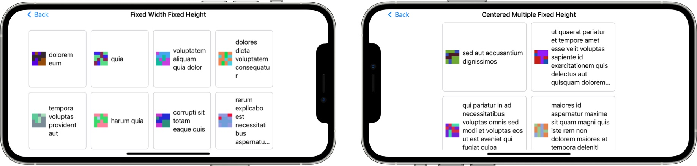
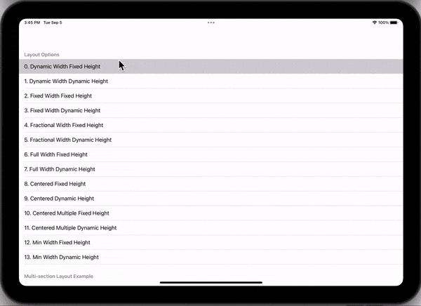

<p align="center">
  
</p>

<p align="center">
    
    
    
</p>

# Composure 

Create complex layouts with UICollectionView using compositional layout. With Composure, you do not need to spend time writing boiler plate code or get into the nitty gritty details of Compositional Layouts. A lot of the complexity is handled for you by Composure.

## Create layouts like these with ease:





## Installation (iOS, macCatalyst)

### Swift PM
Add Composure to your project via Swift Package Manager.

```
https://github.com/eclypse-tms/Composure
```

### Cocoapods
Add Composure to your project via Cocoapods.

```
pod 'Composure', '~> 1.2.2'
```

### Manual
Simply add the files in the [Sources](./Sources/Composure) folder into your project.

## Usage

### Step 1

Create an `enum` that defines each section in your CollectionView and make this enum conform to `Int`, `CaseIterable`, `DefinesCompositionalLayout` protocols as shown below:

```
import UIKit
import Composure

// The enum must be an Int type. Each case in this enum also defines 
// the presentation order of those sections in your collection view.   
enum MyCustomLayout: Int, CaseIterable, DefinesCompositionalLayout {
    case section1
    case section2
    
    /// REQUIRED:  
    func layoutInfo(using layoutEnvironment: NSCollectionLayoutEnvironment) -> CompositionalLayoutOption {
        switch self {
        // cells in this section take up the available width but their height is unknown
        case .section1:
            return .fullWidthDynamicHeight(estimatedHeight: 75)
        // cells in this section have a fixed height but their width changes depending on the contents
        case .section2:
            return .dynamicWidthFixedHeight(estimatedWidth: 150, fixedHeight: 150)
        }
    }

    /// OPTIONAL: Only needed if you have header or footer views for each section
    func headerInfo(using layoutEnvironment: NSCollectionLayoutEnvironment) -> CompositionalLayoutOption? {
        switch self {
        case .section1:
            return .fullWidthFixedHeight(fixedHeight: 30)
        case .section2:
            return .fullWidthFixedHeight(fixedHeight: 55)
        }
    }

}
```

### Step 2
In your View Controller while configuring your collection view, add this line to auto-generate the layout based on the enum definitions in Step 1:

```
    override func viewDidLoad() {
        super.viewDidLoad()
        ...
        collectionView.collectionViewLayout = generateCompositionalLayout(with: MyCustomLayout.allCases)
        ...
    }
```

### Result
The cells in section 1 will be laid out taking up all available space width-wise while adjusting the height as needed. The cells in section 2 will be laid out with dynamic width while their height is fixed. 

<p align="center">
  
</p>

## All Layout Options
This repository includes an [example project](./Example/Example.xcodeproj) where you can see all possible layouts this library supports. 

<p align="center">
  
</p>


## Design Choices
1. Designed to work with vertical scrolling views since most of the forms are also laid out that way.
1. Each section in your view contains a single type of layout. Even though it is possible to mix and match different type of layouts within the same section in Compositional Layouts, this library is designed to accept a single type of layout per section.
1. Each collection layout group takes the entire available width. If you are not familiar with "Layout Groups", a diagram of a layout group can be found on [apple's site](https://developer.apple.com/documentation/uikit/uicollectionviewcompositionallayout).
1. For header and footer views, UICollectionView.elementKindSectionHeader and UICollectionView.elementKindSectionFooter types are supported.

## Assumptions
1. The cells, header or footer views you use with this library have to be unambiguously constrained. Under-constrained or improperly constrained cells will not work.
1. Consistent spacing around each cell within each section.


## More Information
* There are additional layout options which are detailed in [this medium blog](https://blog.eclypse.io/create-forms-with-compositional-layout-in-uicollectionview-d89e6b6923c2). 
* We encourage you to run the included example project and select an iPad or iOS device to see the nuances in various layouts.


